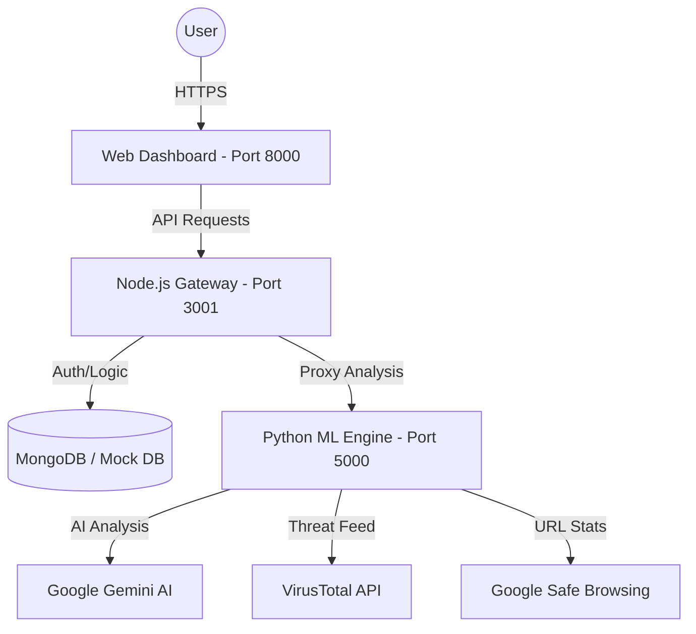

# Guardian Shield 🛡️
### AI-Powered Cybersecurity & Threat Intelligence Suite

Guardian Shield is a comprehensive, enterprise-grade cybersecurity solution designed to protect users from modern digital threats. Leveraging advanced AI models, real-time threat intelligence feeds, and a secure modular architecture, Guardian Shield provides a robust defense against phishing, malware, and sophisticated social engineering attacks.

---

##  Vision & Purpose
In an era of rapidly evolving cyber threats, Guardian Shield aims to democratize high-level security. Our goal is to provide individuals and organizations with the tools they need to identify, analyze, and neutralize threats before they cause harm.

##  Core Security Modules

###  Phishing Guard
- **Heuristic AI Analysis**: Utilizes Gemini 1.5 Flash to analyze text for emotional manipulation, urgency, and fraud patterns.
- **Deep URL Inspection**: Integrates with VirusTotal and Google Safe Browsing to cross-reference URLs against millions of known malicious domains.
- **Zero-Day Detection**: Identifies brand new phishing patterns (typosquatting, homoglyph attacks) using sophisticated AI heuristics.

###  Voice Shield
- **Real-Time Caller ID**: Instantly identifies callers and maps them to carriers and geographical locations.
- **Spam Detection**: Cross-references numbers against community-driven spam databases.
- **Carrier Attribution**: Provides details on the registered SIM carrier and state-level registration info for Indian numbers.

### 🛡️ App Sentinel
- **Multi-Engine Analysis**: Scans uploaded files/APKs against 60+ antivirus engines via VirusTotal.
- **Static Analysis**: Identifies suspicious permissions and code patterns within mobile applications.

###  Secure Vault
- **AES-256 Encryption**: Highly secure storage for passwords, notes, and sensitive credentials.
- **Zero-Knowledge Architecture**: In its real-mode, data is encrypted locally before reaching the database.

### 🤖 Cyber Assist (AI Chatbot)
- **Instant Triage**: Get immediate advice on what to do if you suspect you've been hacked.
- **Knowledge Base**: Access a localized repository of cybersecurity best practices and emergency contacts.

---

##  System Architecture

Guardian Shield utilizes a **Hybrid Microservices Architecture** to ensure high availability and performance.



## � Project Structure

```text
guardian-shield/
├── services/
│   ├── api/                 # Node.js Gateway & Orchestration (Express/TS)
│   │   ├── src/
│   │   │   ├── controllers/ # Request handlers & Mock logic
│   │   │   ├── routes/      # Endpoint definitions
│   │   │   └── middleware/  # Auth & Security layers
│   │   └── mock_users.json  # Persistence for Offline Mode
│   └── ml-engine/           # Intelligence Engine (FastAPI/Python)
│       ├── phishing.py      # AI Phishing & URL Analysis
│       ├── voice.py         # Caller ID & Carrier Intelligence
│       └── main.py          # FastAPI Application Entry
├── legacy/
│   └── frontend/            # High-Performance Web Dashboard
│       ├── index.html       # Entry point
│       ├── js/              # Client-side routing & API interaction
│       └── css/             # Cyber Guard Premium Styling
├── start_app.bat            # Automated service orchestrator
└── README.md                # Project documentation
```

---

## � Technology Stack

| Layer | Technologies |
| :--- | :--- |
| **Frontend** | HTML5, Advanced CSS3, JavaScript (Legacy Premium), FontAwesome |
| **Gateway & Auth** | Node.js, Express, TypeScript, JWT, Bcrypt |
| **Intelligence Engine** | Python 3.9+, FastAPI, Httpx, Gemini AI |
| **Data Mastery** | MongoDB (Production), In-memory JSON (Testing/Offline) |
| **Infrastructure** | Windows/Linux support, PowerShell Setup Scripts |

---

##  Getting Started

### Prerequisites
- **Node.js**: v16.x or higher
- **Python**: v3.9.x or higher
- **API Keys**: Required for real-time analysis (Gemini, VirusTotal, NumVerify)

### Installation (One-Click Setup)
The project includes a unified startup script that handles dependency installation and service orchestration.

1. **Clone & Enter**:
   ```powershell
   git clone <repository-url>
   cd guardian-shield
   ```

2. **Launch**:
   ```powershell
   .\start_app.bat
   ```

### Manual Service Start
If you prefer to run services individually:
- **ML Engine**: `cd services/ml-engine && python main.py`
- **Node API**: `cd services/api && npm run dev`
- **Web App**: `python -m http.server 8000 --directory legacy/frontend`

---

##  Configuration & Environment
Create a `.env` file in `services/api` and `services/ml-engine` following the pattern below:

```env
# Essential API Keys
GEMINI_API_KEY=your_key_here
VIRUSTOTAL_API_KEY=your_key_here
NUMVERIFY_API_KEY=your_key_here

# Server Config
PORT=3001
JWT_SECRET=your_secure_random_string
```

---

##  Contributing
We welcome contributions to Guardian Shield! 
1. Fork the Project.
2. Create your Feature Branch (`git checkout -b feature/AmazingFeature`).
3. Commit your Changes (`git commit -m 'Add some AmazingFeature'`).
4. Push to the Branch (`git push origin feature/AmazingFeature`).
5. Open a Pull Request.

---

## 📄 License & Security
- This project is licensed under the **MIT License**.
- **Security Notice**: Never commit your `.env` files or API keys to public repositories.

---
*Created with ❤️ by the Ishwari*
